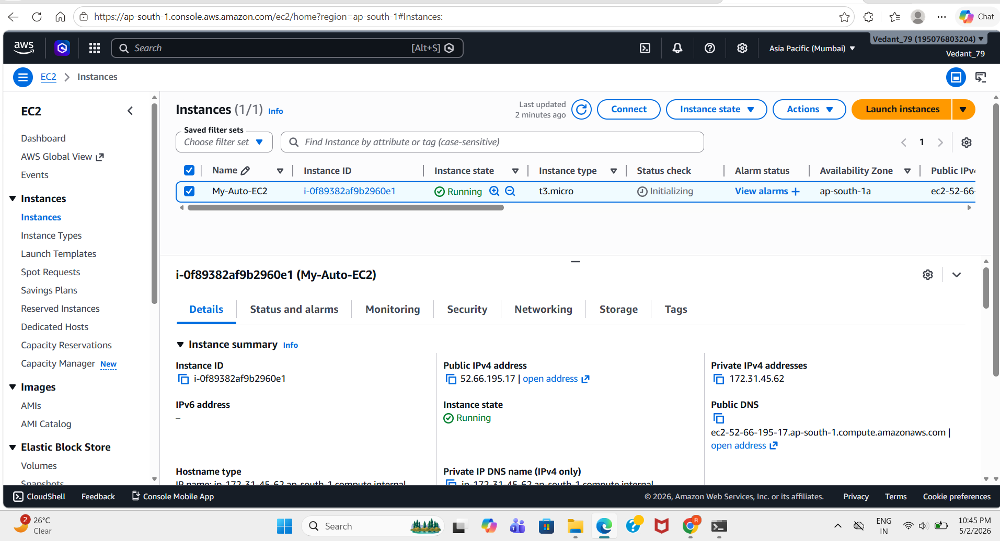
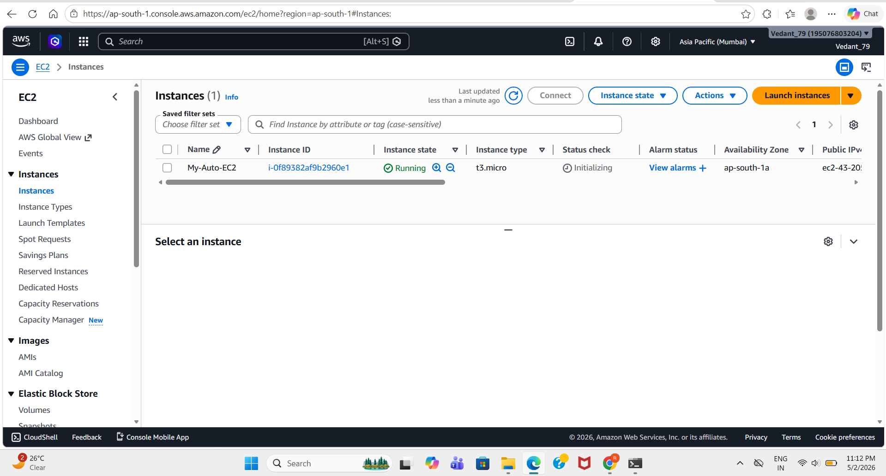
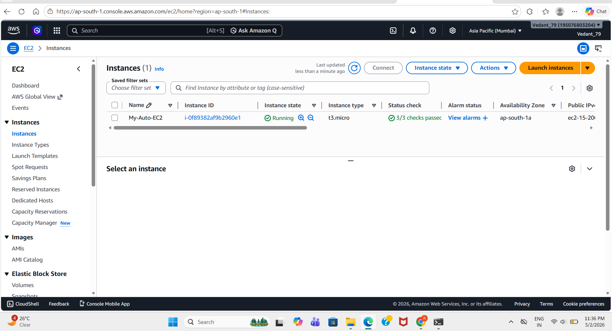
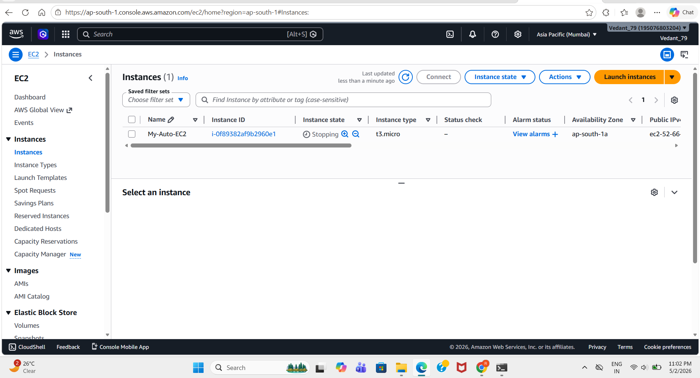
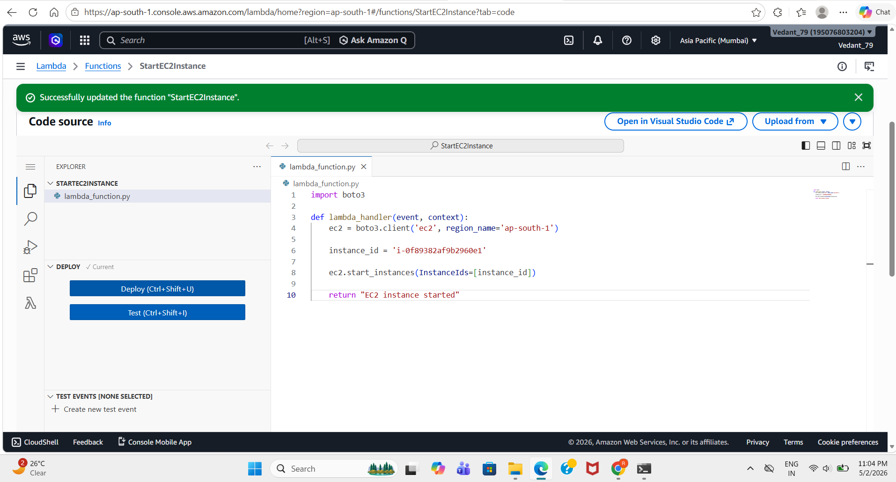
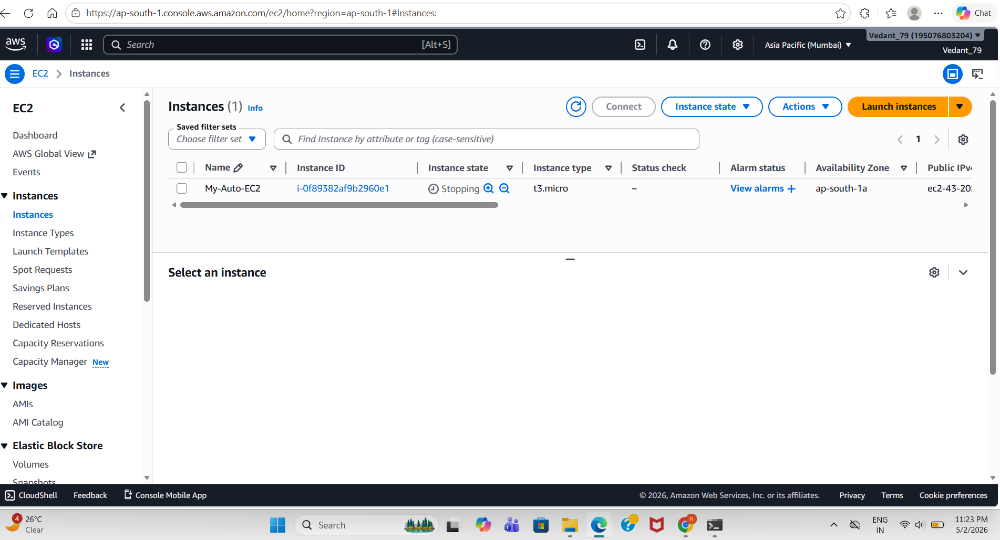
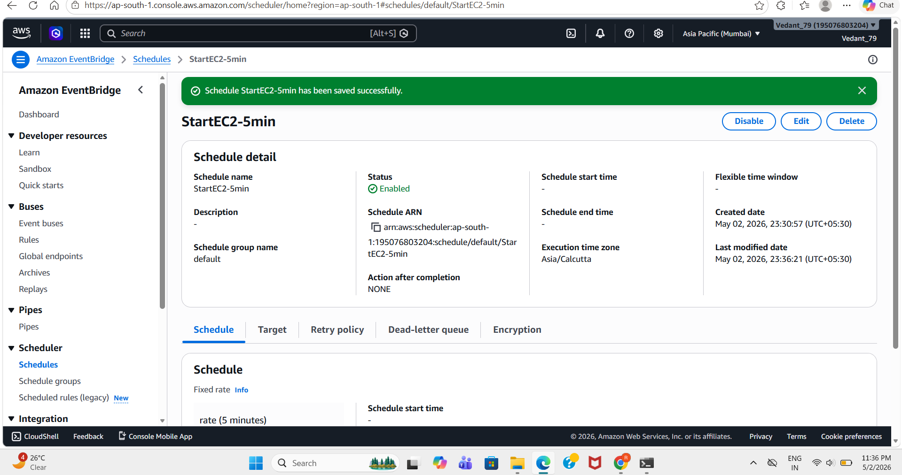

# 🚀 EC2 Auto Start/Stop Automation


---

## 📌 Project Overview

This project automates the **start and stop of Amazon EC2 instances** using AWS Lambda and EventBridge Scheduler.
It ensures that cloud resources are only active when needed, helping reduce **AWS costs** and improving efficiency.

---

## 🎯 Objective

* Automate EC2 lifecycle (Start & Stop)
* Reduce unnecessary cloud cost
* Eliminate manual intervention
* Build real-world AWS automation

---

## 🧰 AWS Services Used

* Amazon EC2
* AWS Lambda
* Amazon EventBridge (Scheduler)
* AWS IAM

---

## 🏗️ Architecture Flow

```
EventBridge Scheduler
        ↓
   AWS Lambda
        ↓
   Amazon EC2
(Start / Stop Instance)
```

---

## ⚙️ How It Works

1. EventBridge triggers Lambda based on schedule
2. Lambda executes Python (boto3) code
3. EC2 instance is started or stopped automatically
4. IAM role ensures required permissions

---

## 📁 Project Structure

```
project-6-ec2-auto-scheduler/
│
├── start_ec2.py        # Start EC2 instance
├── stop_ec2.py         # Stop EC2 instance
│
├── Images/
│   ├── ec2_created.png
│   ├── ec2_running.png
│   ├── ec2_stopped.png
│   ├── start_lambda.png
│   ├── Eventbridge_Scheduler_start.png
│   ├── Eventbridge_Scheduler_stop.png
│
└── README.md
```

---

## 💻 Lambda Code

### 🔴 Stop EC2

```python
import boto3

def lambda_handler(event, context):
    ec2 = boto3.client('ec2', region_name='ap-south-1')
    instance_id = 'i-0f89382af9b2960e1'
    ec2.stop_instances(InstanceIds=[instance_id])
    return "EC2 instance stopped"
```

---

### 🟢 Start EC2

```python
import boto3

def lambda_handler(event, context):
    ec2 = boto3.client('ec2', region_name='ap-south-1')
    instance_id = 'i-0f89382af9b2960e1'
    ec2.start_instances(InstanceIds=[instance_id])
    return "EC2 instance started"
```

---

## ⏰ Scheduling

### 🔹 Testing Mode

```
rate(5 minutes)
```

### 🔹 Production Mode

* Start EC2 (Morning):

```
0 3 * * ? *
```

* Stop EC2 (Night):

```
0 16 * * ? *
```

---

## 🔐 IAM Configuration

* Created IAM role for Lambda
* Attached policy: **AmazonEC2FullAccess**
* Permissions enabled:

  * ec2:StartInstances
  * ec2:StopInstances

---

## 📸 Output Screenshots

### 🟢 EC2 Instance Created


### 🟢 EC2 Running


### 🚀 EC2 Started via Automation


### 🔴 EC2 Stopped


### ⚙️ Lambda Function (Start)


### ⚙️ Lambda Function (Stop)


### ⏰ EventBridge Scheduler (Start)


### ⏰ EventBridge Scheduler (Stop)


---

## 🧪 Testing & Validation

* Tested Lambda functions manually
* Verified automated execution via EventBridge
* Observed EC2 state transitions:

  * Running → Stopped
  * Stopped → Running

---

## ⚠️ Challenges Faced

* Lambda timeout error → fixed by increasing timeout
* IAM permission error → resolved with proper policy
* Scheduler timing confusion → understood execution intervals

---

## 🧠 Key Learnings

* IAM role & permission management
* Lambda automation using boto3
* EventBridge scheduling system
* Debugging real AWS issues

---

## 🚀 Outcome

Successfully built a **serverless automation system** that controls EC2 lifecycle and reduces operational cost.

---

## 🔮 Future Improvements

* Multi-instance automation using tags
* CPU-based auto shutdown (CloudWatch integration)
* Billing alerts for cost monitoring

---


---

## 👨‍💻 Author - **Vedant Satkar**  
📧 Email: vedantssatkar@gmail.com  
🔗 LinkedIn: https://www.linkedin.com/in/vedant-satkar-731bb2298  
🔗 GitHub: https://github.com/VedantSatkar  

---
